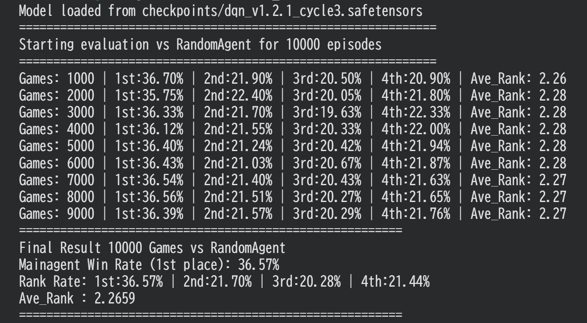
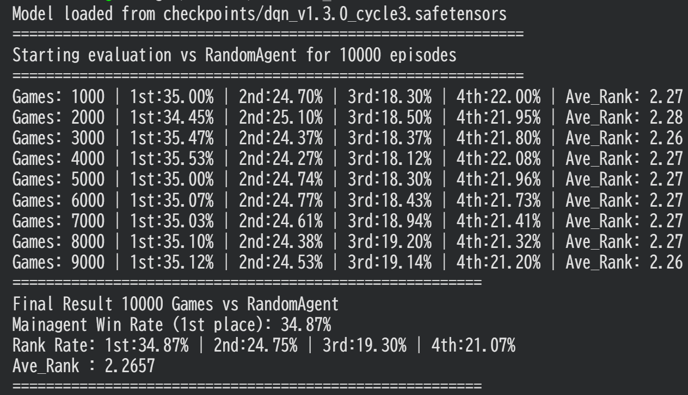
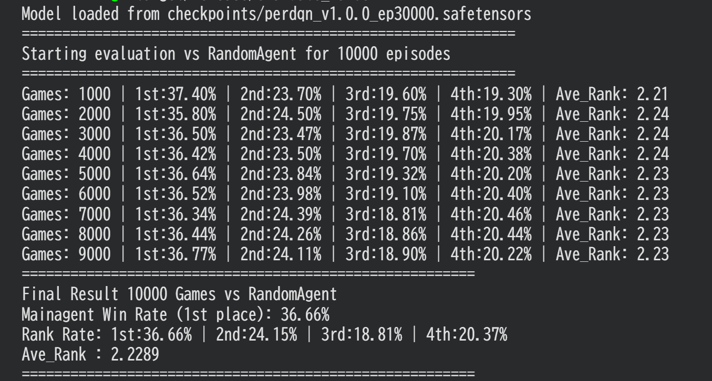
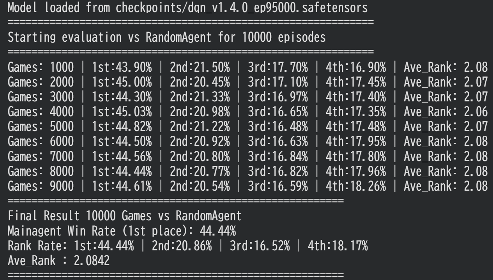

# Sevens_Rust_RL

Rustで実装された、７並べ(Sevens)の強化学習プロジェクトです。ゲーム環境からニューラルネットワークの学習まで、外部ランタイム(Python等)に依存せず、100%Rustで完結しています。

## ⚡Highlights

・Pure Rust Implementation:ゲームロジックから学習ループまで全てRustで記述。

・High Performance: Google ColabのCPU環境において、RandomAgent対戦で 10000 game/secを超えるスループットを確認。(dqn_v1.4.0では100,000戦の学習が2時間で完了)

・Lightweight ML: Hugging Face製の機械学習フレームワークcandleを採用している。

## ♣　Sevens rule　♠

・基本ルール：7を中心として隣接する数字を場に出し、先に手札を0にした順番で順位が決定する

・パス回数：３回まで可能。４回目のパスは出せるカードが無い時にのみ可能。４回目のパスをしたプレイヤーは即座にドボン。

・ドボン者のカードは公開情報となるが、場に繋がる数字までしか場には出されない（ドボン者が出てもゲーム続行）

・ドボンした順番で最下位から埋まる

・配られたカードの中にダイヤの７があった人が一番手となり、自分->下家->対面->上家->自分となる。また、全てのスートの7は開始時に場に自動で出される。

・全員があがるかドボンになった時点でゲーム終了

## 　Teck Stack

・Language: Rust

・ML Framework: candle "0.10.2" (by Hugging Face)

・RL Algorithm: Dueling DDQN / n-step RL

## 📜　Detail

・lr-schedulerはCosineAnnealingWarmRestartsを実装しています

・unwrap()とexpect()について：コード内ではunwrap()とexpect()が使用されていますが、そこでエラーが出た場合は学習継続困難なため止めたほうが良く、複雑なエラーハンドリングを避けています。しかし、20万戦ほど回しても一度もexpect()を呼び出されていないため、安全は確認しております。

・ProcessorでRawStateをNNに入れる値に変換し、一括でTensorにしています。そのため、特徴量を変えたい場合は、Processorのwrite_buf()をいじってください。

## 結果

>図:random3体に対する勝率(dqn_v1.2.1)

ランダム相手ではあるが、出せるカードがあるなら自滅できないルールのため、それなりの勝率です。

正常に学習ができていることが確認できます

>図:maskの扱いを変更しqnetにbuffer_layerを入れた後(dqn_v1.3.0)

v1.3.0では、平均着順は変わらないものの、２着率が上昇。次はラス率を下げつつトップを取る方法を工夫して教えたい

>図:per実装後の勝率上昇

PERにより３着率が下がり、1着と2着が増えているのがわかる。PERの実装に成功した

>図:モデルの軽量化と更新頻度の見直し後

学習を高速化したいため、residualblockを減らし、更新頻度も減らしたら結果的に強くなった。

おそらく、以前は表現力がありすぎたため過学習を起こしていたと思われる

## ToDo

・~~ゲームの並列化~~　-> batchを組むための待ち時間の方がもったいない気がするので一旦保留します。dqn_v1.4.0では学習しながらでも、シングルスレッドで10万戦が2時間で終わります

・Attentionに対応するためのseqを作るメソッド -> attentionは表現力高すぎて過学習してしまうかも

・DQNの拡張で後悔最小化する方法を思いついたので、そのうち実装。
